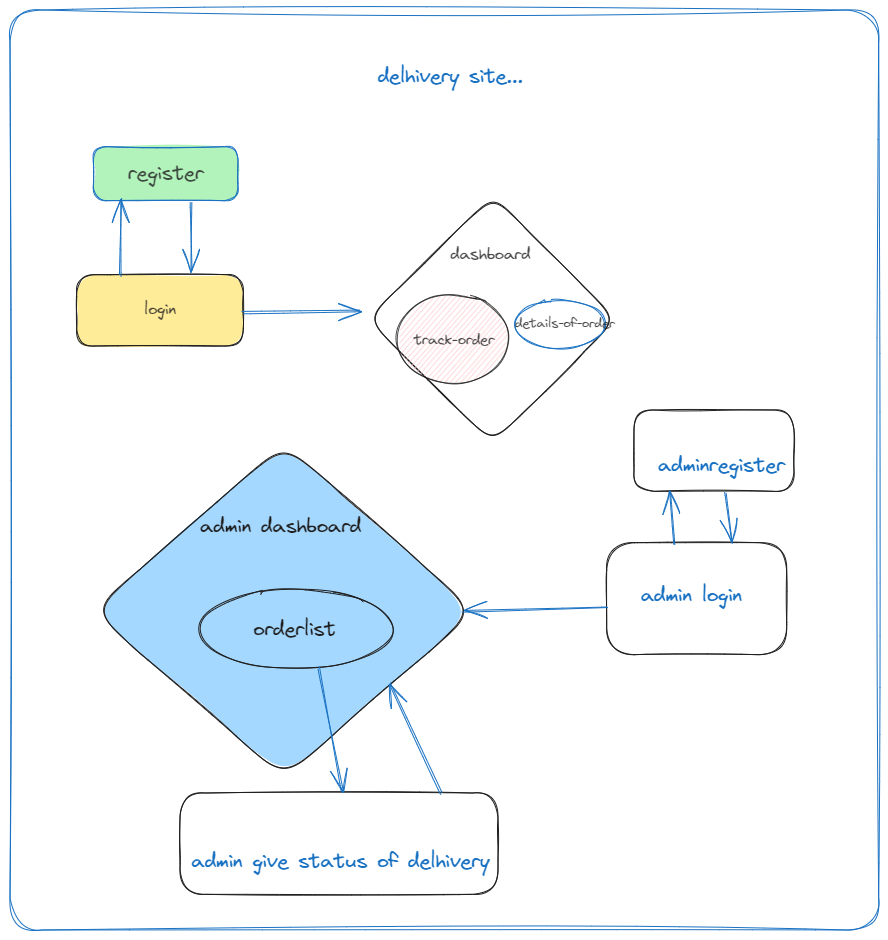

# delhivery

Brief description or overview of your project.




## Installation

- Install beekeper


- how to run

go to xampp > htso

```
git clone https://github.com/singhtameshwar/delivery-system-php.git

cd delivery-system-php
```


Provide step-by-step instructions on how to install and set up your project. Include any dependencies and prerequisites needed.


## Usage

Explain how to use your project, including examples and demos if applicable.

